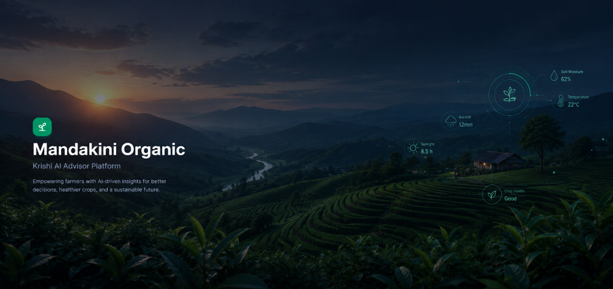

# Krishi AI Advisor 🌾

[](https://krishi-ai-advisor.vercel.app/)
[](https://krishi-ai-advisor.onrender.com/)
[](https://react.dev/)
[](https://vitejs.dev/)
[](https://nodejs.org/)
[](https://expressjs.com/)
[](https://www.mongodb.com/cloud/atlas)
[](https://tailwindcss.com/)
[](https://ai.google.dev/)
[](https://jwt.io/)

> An AI-powered agricultural advisory web application engineered for field supervisors of the **Mandakini Organic Produce Collective** in Uttarakhand, India. The platform bridges the gap when local extension officers are unreachable in remote mountain block fields by delivering instant, localized, and organic crop advisory.

---

## 🔗 Live Demo & Deployment URLs

- 🚀 **Live Deployed Frontend**: [https://krishi-ai-advisor.vercel.app/](https://krishi-ai-advisor.vercel.app/)
- ⚡ **Production Backend API**: [https://krishi-ai-advisor.onrender.com/](https://krishi-ai-advisor.onrender.com/)
- 🎥 **Demo Video**: *[Recording in Progress — Video Walkthrough Placeholder]*

---

## 📷 Screenshots & Interface Preview

### 1. Database Schema & Document Model


### 2. User Authentication & Login Portal


### 3. Field Supervisor Dashboard & AI Advisory Interface


---

## ✨ Key Features

- 🌾 **AI-Powered Organic Crop Advisor**: Tailored specifically for Himalayan mountain farming (Tomatoes, Potatoes, Wheat, Paddy, Rajma, Mustard, Brinjal). Generates structured advisory cards (Problem, Causes, Organic Actions, Precautions, Disclaimer).
- 📴 **Zero-Downtime Offline Fallback Engine**: If internet connectivity is lost or Gemini API quota is exhausted, an offline regex diagnostic engine scans pre-seeded disease and pest databases to instantly present matching advice.
- 🏷️ **AI Source Indicators**: Clear UI badges distinguish whether an advisory response came from **Online Gemini AI** or **Offline Knowledge Base**.
- 🎙️ **Voice Assistant & Speech Dictation**: Browser-native voice input for hands-free queries in field conditions, featuring real-time audio wave visualization.
- 🔊 **Bilingual Text-to-Speech (TTS)**: Synthesizes voice playback for advisories in both Indian Hindi (`hi-IN`) and English (`en-US`).
- 🌐 **Full Devanagari Localization**: Instant toggle between English and Hindi for all UI elements, cards, guide categories, and weather alerts.
- 🌦️ **Weather Alert & Risk Engine**: Integrates Open-Meteo weather parameters to detect agricultural risks (Frost, Cloudburst, High Humidity) and provide preventive crop tips.
- 📚 **Comprehensive Field Guides**: Interactive reference manuals for Crop Diseases, Organic Pest Management, and Post-Harvest compliance.
- 🔐 **Security & Multitenancy**: User-scoped session logs, JWT state management, Google OAuth 2.0 integration, bcrypt password hashing, and express-rate-limit brute force protection.

---

## 🛠️ Technology Stack

| Layer | Technologies & Tools |
| :--- | :--- |
| **Frontend Core** | React 19, Vite 8, React Router v7 |
| **Styling & UI** | Tailwind CSS v4, Lucide React Icons, Framer Motion 12 |
| **HTTP Client** | Axios (JWT Authorization Attach & 401 Expiration Interceptors) |
| **Speech Engine** | Web Speech API (`webkitSpeechRecognition` & `window.speechSynthesis`) |
| **Backend Framework** | Node.js (ES Modules), Express.js (MVC Architecture) |
| **Database** | MongoDB Atlas Cloud via Mongoose ODM |
| **AI Integration** | Google Generative AI Node SDK (`@google/generative-ai`) |
| **Security & Auth** | JsonWebToken, Bcrypt, Passport.js (Google OAuth 2.0), Helmet, Express Rate Limit |
| **Hosting** | Vercel (Frontend SPA) & Render (Backend Web Service) |

---

## 📦 Installation & Local Setup

### Prerequisites
- Node.js (v18.x or higher)
- npm (v9.x or higher)
- MongoDB Atlas cluster connection string (or local MongoDB instance at `mongodb://127.0.0.1:27017`)

### Step 1: Clone Repository
```bash
git clone https://github.com/aniketdobriyal/Krishi-AI-Advisor.git
cd Krishi-AI-Advisor
```

### Step 2: Install Backend Dependencies
```bash
cd backend
npm install
```

### Step 3: Install Frontend Dependencies
```bash
cd ../frontend
npm install
```

---

## 🔑 Environment Variables

### Backend Configuration (`backend/.env`)
Create a `.env` file inside `backend/`:

```env
# Server Configuration
PORT=5000
NODE_ENV=development

# Database Connection
MONGO_URI=mongodb+srv://<db_user>:<password>@cluster0.xxx.mongodb.net/krishi_ai_advisor?retryWrites=true&w=majority

# JWT & Application URLs
JWT_SECRET=your_super_secret_jwt_key_here
CLIENT_URL=http://localhost:5173
BACKEND_URL=http://localhost:5000

# Google OAuth Credentials
GOOGLE_CLIENT_ID=your_google_client_id.apps.googleusercontent.com
GOOGLE_CLIENT_SECRET=your_google_client_secret

# AI Advisory Key
GEMINI_API_KEY=your_gemini_api_key
```

### Frontend Configuration (`frontend/.env`)
Create a `.env` file inside `frontend/`:

```env
VITE_API_URL=http://localhost:5000
```

---

## 💻 Running Frontend

In the `frontend/` directory, run:
```bash
npm run dev
```
Open [http://localhost:5173](http://localhost:5173) in your browser.

---

## ⚙️ Running Backend

In the `backend/` directory, run:
```bash
npm run dev
```
The server will automatically connect to MongoDB, seed default collections if empty, and listen on [http://localhost:5000](http://localhost:5000).

---

## 🔌 API Endpoints Summary

| Method | Endpoint | Protection | Description |
| :--- | :--- | :--- | :--- |
| **POST** | `/api/auth/register` | Public | Registers a new supervisor account with bcrypt hashing |
| **POST** | `/api/auth/login` | Public | Authenticates credentials and returns 7-day JWT token |
| **GET** | `/api/auth/google` | Public | Initiates Google OAuth 2.0 authentication redirect |
| **GET** | `/api/auth/google/callback` | Public | Passport Google OAuth callback redirect handler |
| **GET** | `/api/auth/profile` | Protected | Fetches active authenticated user profile |
| **GET** | `/api/crops` | Public | Returns agricultural crops directory |
| **GET** | `/api/diseases` | Public | Returns plant disease directory with treatments |
| **GET** | `/api/pests` | Public | Returns organic pest management reference guide |
| **GET** | `/api/post-harvest` | Public | Returns post-harvest handling & storage checklists |
| **POST** | `/api/chat` | Protected | Submits prompt to Gemini AI / Offline Fallback engine |
| **GET** | `/api/history` | Protected | Retrieves user-scoped saved diagnostic chat sessions |
| **POST** | `/api/history` | Protected | Saves or updates active chat session in MongoDB |
| **DELETE** | `/api/history/:id` | Protected | Deletes specified diagnostic session |
| **GET** | `/api/search?q=` | Public | Global regex search across crops, diseases, and guides |
| **GET** | `/api/weather` | Public | Returns localized weather risks and preventive advice |
| **GET** | `/api/activities` | Protected | Returns user-scoped activity logs |
| **GET** | `/api/config` | Public | Checks backend Gemini API key configuration status |

---

## 📂 Folder Structure

```
Krishi-AI-Advisor/
├── backend/
│   ├── .env.example
│   ├── package.json
│   └── src/
│       ├── app.js       # Express middleware, Helmet, CORS, Passport, routes
│       ├── server.js    # Entrypoint, Mongo connection, environment validation
│       ├── config/      # db, gemini, models, mongoose, passport, seed
│       ├── controllers/ # auth, chat, disease, history, weather, etc.
│       ├── middleware/  # verifyToken, errorHandler
│       ├── models/      # Mongoose schemas (User, Crop, Disease, Pest, etc.)
│       ├── routes/      # Express API routers
│       └── services/    # chatService, modelManager, searchService, weatherService
├── frontend/
│   ├── .env.example
│   ├── package.json
│   ├── vite.config.js
│   └── src/
│       ├── App.jsx      # Core layout, state routing, header navigation
│       ├── api.js       # Axios base instance with JWT & 401 interceptors
│       ├── components/  # ChatAssistant, DashboardOverview, Guides, Settings, etc.
│       ├── context/     # AuthContext provider
│       ├── pages/       # Login and Register pages
│       └── services/    # Client API request helpers
├── deployment_checklist.md
├── API_REFERENCE.md
├── CONTRIBUTING.md
├── W5_SchemaDiagram_TBI-26100505.png
└── README.md
```

---

## 🏗️ Architecture Overview

```
 [ React 19 Frontend (Vite) ]
              │
    (HTTP + JWT Header)
              ▼
   [ Node.js / Express API ] ◄───────► [ MongoDB Atlas Cloud ]
              │
    ┌─────────┴─────────┐
    ▼                   ▼
[ Gemini AI SDK ]   [ Open-Meteo Weather API ]
(Dynamic Failover)  (Risk Calculations)
```

1. **Client Layer**: React 19 SPA running on Vite. Manages user interface, voice recognition, speech synthesis, local language preferences, and state synchronization.
2. **REST API Layer**: Node.js and Express.js backend using MVC architecture. Uses `verifyToken` middleware to enforce JWT authorization on protected routes.
3. **Database Layer**: MongoDB Atlas storing structured documents for Users, Crops, Diseases, Pests, Post-Harvest Guides, Chat Sessions, and Activity Logs.
4. **External Integrations**:
   - **Google Gemini API**: Online generative AI model.
   - **Open-Meteo API**: Live weather forecasting data.
   - **Google OAuth 2.0**: Passport.js single sign-on strategy.

---

## 🤖 AI Feature Explanation & Multi-Model Engine

- **Dynamic Model Failover**: `ModelManager` maintains a priority cascade of Gemini models (`Gemini 3.6 Flash` -> `Gemini 3.5 Flash` -> `Gemini 3.5 Flash Lite` -> `Gemini 3.1 Flash Lite`).
- **Cooldown Cache**: If a model returns rate-limit (429) or quota errors, it is placed in a 10-minute cooldown cache and the manager automatically fails over to the next candidate model.
- **Offline Keyword Diagnostic Engine**: If `GEMINI_API_KEY` is missing or network connectivity is cut, `chatService` executes regex symptom matching against seeded crop diseases/pests to generate structured organic guidance.
- **Organic Agriculture Guardrails**: System prompts enforce non-chemical biological remedies compliant with Mandakini Organic Collective guidelines.
- **Source Transparency**: Every chat response returns an indicator (`gemini` or `offline`) displayed in the UI as a badge.

---

## 🎙️ Voice Assistant & Text-to-Speech

- **Hands-Free Field Input**: Uses the browser-native **Web Speech API** (`webkitSpeechRecognition`) to transcribe spoken field queries directly into the search bar.
- **Supported Languages**: Recognizes speech in **Hindi (`hi-IN`)** and **English (`en-US`)**.
- **Speech Synthesis (TTS)**: Built-in voice player using `window.speechSynthesis` reads out structured advisory sections in clear spoken Hindi or English.
- **Browser Compatibility**: Supported natively on Chromium browsers (Google Chrome, Microsoft Edge, Brave) running over HTTPS or `localhost`.

---

## 🌦️ Weather Alert System

- **Himalayan Micro-climate Monitoring**: Fetches real-time temperature, relative humidity, wind speed, and precipitation data from Open-Meteo API.
- **Threshold Analysis**: Automatically computes agricultural risks including **Frost Damage**, **High Humidity Blight Risk**, **Torrential Dew**, and **Cloudburst Safety**.
- **Preventive Crop Recommendations**: Provides immediate actionable field tips (e.g., applying light night irrigation to protect tubers during frost warnings).

---

## 🔐 Authentication Flow & Security Hardening

```
User Login ──► Express /auth/login ──► Bcrypt Compare ──► Signed 7-Day JWT
                                                                │
Axios Interceptor ◄── Bearer Token Injected Into Requests ◄─────┘
        │
401 Unauthorized Detected ──► Purge Credentials ──► Redirect /login?expired=true
```

1. **Password Encryption**: Passwords are hashed with `bcrypt` (10 salt rounds).
2. **JWT Authorization**: Stateless tokens expire in 7 days and are verified on protected routes.
3. **Axios Interceptors**: Automatically attach token to outbound requests and catch `401 Unauthorized` responses to clear invalid sessions.
4. **Rate Limiting**: Auth routes (`/api/auth/*`) are protected by `express-rate-limit` (max 5 requests per 15 minutes).
5. **Security Headers**: Hardened with `helmet` middleware and hidden `x-powered-by` header.

---

## 🚀 Deployment Overview

The application is deployed on production cloud services:

- **Frontend**: Deployed on **Vercel** with single-page app rewrite rules (`vercel.json`).
  - **Live URL**: [https://krishi-ai-advisor.vercel.app/](https://krishi-ai-advisor.vercel.app/)
- **Backend**: Deployed on **Render** as a Node.js Web Service.
  - **Live URL**: [https://krishi-ai-advisor.onrender.com/](https://krishi-ai-advisor.onrender.com/)
- **Database**: **MongoDB Atlas** Cloud Cluster (`M0` shared tier).

### 💤 Free-Tier Hosting Behavior
Render's free tier spins down web services after **15 minutes of inactivity**. When opening the live app after a dormant period, the initial request (such as login or data fetching) may take **50–120 seconds** while the instance boots up. Subsequent requests respond with standard low latency.

---

## 🔮 Future Enhancements

- 📸 **AI Plant Disease Image Diagnosis**: Integrate Gemini 3.6 Multimodal Vision to analyze leaf photos taken directly by field supervisor smartphones.
- 📍 **GPS-Based Hyper-Local Weather**: Use geolocation to pinpoint field coordinates for block-level weather warnings and soil moisture estimation.
- 🔔 **Push Notifications**: Web push notifications for sudden frost alerts and heavy rainfall warnings.
- 📱 **Progressive Web App (PWA)**: Service worker caching and offline manifest for full installation on mobile devices without app store downloads.
- 📊 **Cooperative Manager Analytics**: Dashboard view for collective directors to view aggregate disease outbreaks across different agricultural blocks.

---

## 🤝 Credits & Acknowledgements

- **Mandakini Organic Produce Collective**: Regional agricultural context and organic crop management practices for Uttarakhand.
- **Google DeepMind & Gemini Team**: Generative AI models and SDK.
- **Open-Meteo**: Free weather forecasting API.
- **Open Source Ecosystem**: React, Express, Mongoose, Tailwind CSS, Lucide Icons, Framer Motion, and Passport.js.