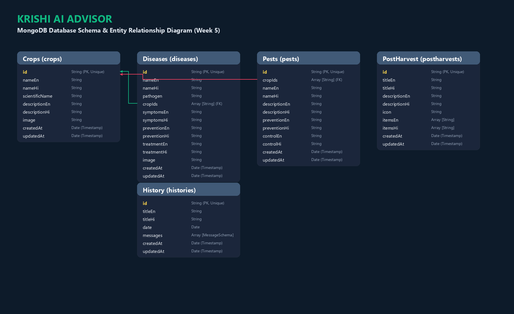

# Krishi AI Advisor 🌾

An AI-powered crop advisory dashboard prototype designed for field supervisors of the **Mandakini Organic Produce Collective** in Uttarakhand, India. 

The application provides supervisors with instant, actionable guidance on crop diseases, organic pest management, and post-harvest compliance, helping bridge the gap when agricultural extension officers are not immediately reachable in remote mountain block fields.

---

## 🌟 Key Features

*   💬 **AI-Powered Advisor Chat**: Interactive conversational interface that queries a public LLM API (**Gemini 1.5 Flash**) configured with custom prompt constraints tailored to Uttarakhand mountain crops and organic farming practices.
*   📴 **Robust Offline Fallback**: In low-connectivity or offline mountainous regions, a built-in search engine automatically scans local disease and pest databases for instant symptom matching and structured responses.
*   🎙️ **Voice Assistance**: Simulates microphone voice dictation with visual soundwave animation and typing feedback to support supervisors dictating queries in field conditions.
*   🔊 **Bilingual Text-to-Speech (TTS)**: Reads advisory sections aloud in clear, synthesized voice formats (supporting both Indian Hindi `hi-IN` and English `en-US`).
*   🌐 **Full Devanagari Localization**: Swaps all user interface cards, databases, settings, alerts, and instructions instantly between English and Hindi.
*   📚 **Interactive Field Guides**:
    *   **Disease Guide**: Crop-filtered directory of regional conditions (Late Blight, Powdery Mildew, Rust, etc.) with organic and biological treatment details.
    *   **Pest Guide**: Reference guide for insect biology, preventions, and control actions.
    *   **Post-Harvest Guide**: Dynamic compliance checklists (Curing, Sorting, Temperature Control, Transit checks) with progress persistence.
*   💾 **Session Logs**: Locally saves diagnostics and chatbot sessions, allowing supervisors to reload previous advisor advice or delete logs.

---

## 🛠️ Technology Stack

*   **Frontend**: React 19 & Vite 8 (ESM setup), Axios
*   **Backend**: Node.js & Express.js MVC Architecture
*   **Styling**: Tailwind CSS v4 (Harmony green-accented theme)
*   **Animations**: Framer Motion 12 (Micro-animations and transitions)
*   **Icons**: Lucide React
*   **Integration**: Google Generative AI Node SDK (`@google/generative-ai`)
*   **Dev Utilities**: Nodemon, CORS, dotenv

---

## 🛡️ Data Privacy & Security Model (Week 6 Upgrade)

The application incorporates a robust User Authentication and Security hardening model:
*   🔑 **JWT Authentication**: User login and registration backed by stateless JSON Web Tokens. Access tokens expire in 7 days and are attached automatically to outbound requests via Axios Request Interceptor.
*   🔄 **Automatic Token Expiration Handling**: Axios Response Interceptor detects `401 Unauthorized` errors, automatically invalidates sessions by purging credentials from browser storage, and redirects the user to `/login` with a clear expiration alert.
*   🔒 **Password Hardening**: User passwords are encrypted on the backend using `bcrypt` with 10 salt rounds. Under no circumstances are password hashes exposed or returned in API responses.
*   🚦 **Request Rate Limiting**: Protects authentication endpoints (`/api/auth/register` and `/api/auth/login`) against brute force attacks using `express-rate-limit` (max 5 requests per 15 minutes).
*   🛡️ **Helmet Hardening & Secure Headers**: Uses `helmet` middleware to set HTTP headers protecting against common vulnerabilities, and hides the `x-powered-by` header.
*   🌐 **Google OAuth Integration**: Allows supervisors to authenticate seamlessly using Google Sign-In via Passport.js, storing account information with `provider: "google"`.
*   🚀 **User-Scoped Multitenancy**: Restricts Chat History and Disease History queries to the logged-in user context. Default seeded history entries remain viewable to all.

---

## 🤖 Responsible AI & Guardrails

To prevent hallucinations and minimize risk to local crops, the advisor runs under strict guardrails:
1.  **Extension Officer Disclaimer**: Every response includes a mandatory warning that advice should be verified with a licensed extension officer.
2.  **Zero-Guessing Uncertainty Protocol**: If the symptoms provided are insufficient to diagnose a disease with reasonable confidence, the system prompts for more parameters (crop age, symptoms, weather conditions) instead of recommending treatments.
3.  **Strict Organic Focus**: The advisory system is constrained to organic, biological, and non-chemical measures in accordance with the Collective's standards.

---

## 🚀 Getting Started

### Prerequisites

*   Node.js (v18.x or higher recommended)
*   npm (or yarn)
*   MongoDB Instance (Local running at `mongodb://127.0.0.1:27017` or MongoDB Atlas Cluster)

### Installation & Setup

1.  Clone the repository:
    ```bash
    git clone https://github.com/aniketdobriyal/Krishi-AI-Advisor.git
    cd Krishi-AI-Advisor
    ```

2.  **Backend Setup**:
    Navigate to the backend directory:
    ```bash
    cd backend
    npm install
    ```
    Create a `.env` file by copying the example template:
    ```bash
    cp .env.example .env
    ```
    Open the `.env` file and input your Gemini API key and MongoDB URI connection string:
    ```env
    GEMINI_API_KEY=AI_zaSyYourKeyHere
    MONGO_URI=mongodb://127.0.0.1:27017/krishi-ai-advisor
    PORT=5000
    ```
    Start the backend server:
    ```bash
    npm run dev
    ```
    The server will connect to MongoDB, automatically seed default collections (Crops, Diseases, Pests, PostHarvest Guides, default History) if empty, and start listening on [http://localhost:5000](http://localhost:5000).

3.  **Frontend Setup**:
    Open a new terminal window, and navigate to the frontend directory:
    ```bash
    cd frontend
    npm install
    ```
    Start the frontend dev server:
    ```bash
    npm run dev
    ```
    Open [http://localhost:5173](http://localhost:5173) in your browser.

---

## 🗄️ Database Integration & Choice (Week 5)

### Database Choice: MongoDB Atlas
MongoDB Atlas was selected for the **Krishi AI Advisor** for several reasons:
- **Flexible Document Model**: Allows seamless storage of complex and nested structures such as advisory message histories and embedded dialog details without rigid SQL joins.
- **Mongoose ODM Integration**: Provides strong schema validation, hooks, and clean MVC separation for data structures in Node.js.
- **Reliable Persistence**: Replaces in-memory storage arrays so supervisor data survives server reloads and browser refreshes.
- **Free Tier Availability**: Provides scalable, zero-cost cloud databases perfect for field testing and remote block supervisor deployments.

### Database Setup Instructions
1. **Sign up**: Go to [MongoDB Atlas](https://www.mongodb.com/cloud/atlas) and register.
2. **Create Cluster**: Create a free-tier shared cluster (M0) in your preferred region.
3. **Database User**: Navigate to *Database Access* and create a user with read/write privileges.
4. **Network Access**: Add IP `0.0.0.0/0` (allow access from anywhere) or whitelist your server's current IP.
5. **Get URI**: Click *Connect*, choose *Drivers (Node.js)*, copy the connection string.
6. **Configure ENV**: Paste it in `/backend/.env` under the variable `MONGO_URI` (replacing password and dbname placeholders).

---

## 🔌 REST API Endpoints

The Express backend exposes the following REST APIs under the `/api` prefix (all persistence is now database-backed via Mongoose):

| Method | Endpoint | Description | Protected | Status Codes |
| :--- | :--- | :--- | :--- | :--- |
| **POST** | `/api/auth/register` | Registers a local user with validation & bcrypt | No | `201`, `400` |
| **POST** | `/api/auth/login` | Authenticates local user, returns JWT and user profile | No | `200`, `401` |
| **GET** | `/api/auth/google` | Initiates Google OAuth consent screen redirect | No | `302` |
| **GET** | `/api/auth/google/callback` | Passport Google OAuth callback redirect | No | `302` |
| **GET** | `/api/auth/profile` | Fetches active user profile details from JWT | Yes | `200`, `401` |
| **GET** | `/api/crops` | Retrieves crops from MongoDB | No | `200` |
| **GET** | `/api/diseases` | Retrieves all plant diseases from MongoDB | No | `200` |
| **GET** | `/api/diseases/:id` | Retrieves details of a specific disease by ID | No | `200`, `404` |
| **GET** | `/api/pests` | Retrieves all pests from MongoDB | No | `200` |
| **GET** | `/api/post-harvest` | Retrieves post-harvest guides from MongoDB | No | `200` |
| **POST** | `/api/chat` | AI Advisor prompt (queries Gemini with DB context) | Yes | `200`, `400`, `401` |
| **GET** | `/api/history` | Retrieves saved user chat sessions from MongoDB | Yes | `200`, `401` |
| **POST** | `/api/history` | Saves or updates user chat session in MongoDB | Yes | `200`, `201`, `400`, `401` |
| **DELETE** | `/api/history/:id` | Deletes user chat session from MongoDB | Yes | `204`, `404`, `401` |
| **GET** | `/api/search?q=` | Case-insensitive regex search across DB collections | No | `200`, `400` |
| **GET** | `/api/config` | Returns whether the Gemini API key is configured | No | `200` |

---

## 🗺️ Schema Diagram

Here is the professional entity relationship/schema diagram showing all collections, fields, and relationships designed and stored in MongoDB Atlas:



The schema diagram is also exported to the root directory as:
- Portable Document Format: [W5_SchemaDiagram_TBI-26100505.pdf](./W5_SchemaDiagram_TBI-26100505.pdf)
- High-Resolution Image: [W5_SchemaDiagram_TBI-26100505.png](./W5_SchemaDiagram_TBI-26100505.png)

---

## 📁 Repository Structure

```
Krishi-AI-Advisor/
├── W4_APICollection_TBI-26100505.json            # Postman REST collection
├── W4_FrontendBackendConnection_TBI-26100505.pdf  # Week 4 PDF Verification Report
├── W5_SchemaDiagram_TBI-26100505.pdf             # Week 5 Database Schema (PDF)
├── W5_SchemaDiagram_TBI-26100505.png             # Week 5 Database Schema (PNG)
├── W5_CRUDVerification_TBI-26100505.pdf          # Week 5 CRUD Verification Report (PDF)
├── backend/             # Express.js MVC backend
│   ├── .env.example     # Environment template
│   ├── .gitignore       # Exclusion rules (node_modules, .env)
│   ├── package.json     # Scripts and server dependencies
│   └── src/
│       ├── app.js       # Middleware, helmet, CORS, passport, and routes config
│       ├── server.js    # Entrypoint, DB connection and startup
│       ├── config/
│       │   ├── db.js    # Seed database contents
│       │   ├── mongoose.js # MongoDB connection module
│       │   ├── seed.js  # Seeder function to auto-populate collections
│       │   ├── gemini.js# Generative AI client initialization
│       │   └── passport.js # Google OAuth passport configuration
│       ├── models/      # Mongoose Schemas (User, Crop, Disease, Pest, PostHarvest, History)
│       ├── controllers/ # Controllers (authController, chatController, historyController, etc.)
│       ├── services/    # Business services (authService, chatService, searchService, etc.)
│       ├── routes/      # REST routing (authRoutes, chatRoutes, historyRoutes, etc.)
│       └── middleware/  # Middlewares (verifyToken, errorHandler)
└── frontend/            # React Vite client code
    ├── .gitignore       # Client exclusion rules
    ├── package.json     # Client scripts and dependencies
    ├── vite.config.js   # Vite config
    └── src/
        ├── App.jsx      # UI router, main protected dashboard shell layout
        ├── api.js       # Axios base instance, JWT attach request, & 401 response interceptors
        ├── main.jsx      # React mounting entrypoint, wraps App in AuthProvider and BrowserRouter
        ├── data.js       # UI static texts and translations
        ├── components/   # Modular dashboard views, ProtectedRoute
        ├── context/      # React contexts (AuthContext)
        ├── pages/        # Views (Login, Register)
        └── services/     # Axios API requests (authService)
```

---

## 🌐 Production Deployment

The project is structured to be deployed with the **Frontend on Vercel** and the **Backend on Render**.

### 🔗 Deployed URLs (Placeholders)
*   **Frontend (Vercel)**: `https://YOUR-VERCEL-APP.vercel.app`
*   **Backend (Render)**: `https://YOUR-RENDER-APP.onrender.com`

---

### 🔑 Environment Variables Setup

#### 1. Backend (Render Environment)
Configure these variables in your Render Web Service dashboard under **Environment**:
*   `NODE_ENV`: Set to `production`
*   `PORT`: `5000` (Render will override this dynamically)
*   `MONGO_URI`: Your MongoDB Atlas Connection String
*   `JWT_SECRET`: A strong, secure secret string for signing JWT tokens
*   `GEMINI_API_KEY`: Your Google Gemini API Key
*   `CLIENT_URL`: The production URL of the frontend (e.g., `https://YOUR-VERCEL-APP.vercel.app`)
*   `BACKEND_URL`: The production URL of the backend (e.g., `https://YOUR-RENDER-APP.onrender.com`)
*   `GOOGLE_CLIENT_ID`: Your Google OAuth Client ID (obtained from Google Developer Console)
*   `GOOGLE_CLIENT_SECRET`: Your Google OAuth Client Secret (obtained from Google Developer Console)

#### 2. Frontend (Vercel Environment)
Configure these variables in your Vercel Project settings under **Environment Variables**:
*   `VITE_API_URL`: The production URL of the backend (e.g., `https://YOUR-RENDER-APP.onrender.com`)

---

### 📝 Step-by-Step Deployment Instructions

#### Part A: Deploying Backend to Render
1.  Sign in to [Render](https://render.com/).
2.  Click **New +** and select **Web Service**.
3.  Connect your GitHub repository.
4.  Configure the service details:
    *   **Name**: `krishi-ai-advisor-backend`
    *   **Root Directory**: `backend`
    *   **Runtime**: `Node`
    *   **Build Command**: `npm install`
    *   **Start Command**: `npm start`
5.  Under **Advanced**, add the Environment Variables specified in the section above.
6.  Click **Create Web Service**.

#### Part B: Deploying Frontend to Vercel
1.  Sign in to [Vercel](https://vercel.com/).
2.  Click **Add New** and select **Project**.
3.  Import your GitHub repository.
4.  In the configuration page, configure:
    *   **Framework Preset**: `Vite` or `Other`
    *   **Root Directory**: `frontend`
    *   **Build Command**: `npm run build`
    *   **Output Directory**: `dist`
5.  Add the Environment Variables (e.g., `VITE_API_URL=https://YOUR-RENDER-APP.onrender.com`).
6.  Click **Deploy**.

---

### 💤 Known Free Tier Limitations (Render)
*   **Spin Down (Sleep)**: Render's free tier Web Services spin down (go to sleep) after **15 minutes of inactivity**. 
*   **Initial Delay**: When a user accesses the app after a period of inactivity, the first backend request (e.g., login or database queries) might take **50–120 seconds** to respond while the server boots up. This is a normal behavior of free hosting resources. Once awake, the server responds with standard low latency.

---

### 🔐 Google OAuth Configuration Update
When deploying to production, the developer must manually update the credentials on Google Cloud Console:
1.  Go to the **APIs & Services > Credentials** page in the [Google Cloud Console](https://console.cloud.google.com).
2.  Select your OAuth 2.0 Client ID.
3.  Update **Authorized JavaScript Origins** to include your Vercel deployment URL (e.g., `https://YOUR-VERCEL-APP.vercel.app`).
4.  Update **Authorized Redirect URIs** to point to the production callback route (e.g., `https://YOUR-RENDER-APP.onrender.com/api/auth/google/callback`).
5.  Save changes. (Note: It may take a few minutes for Google's servers to apply the updates).